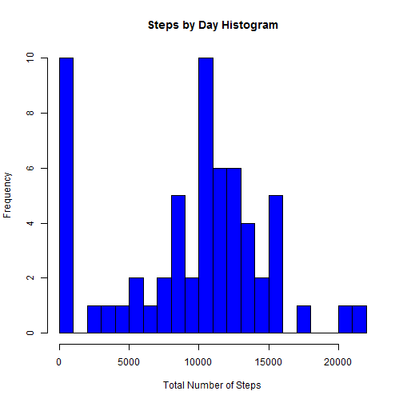
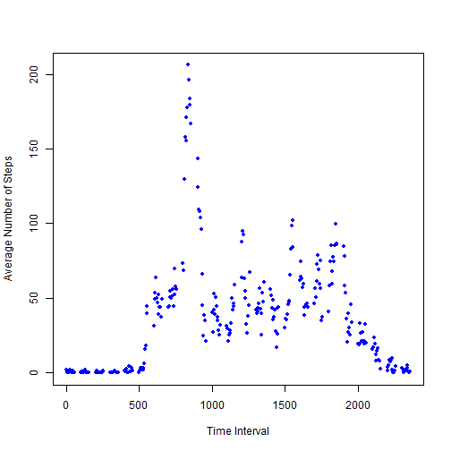
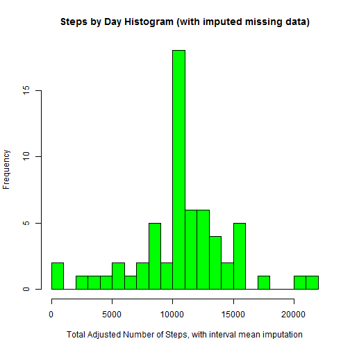
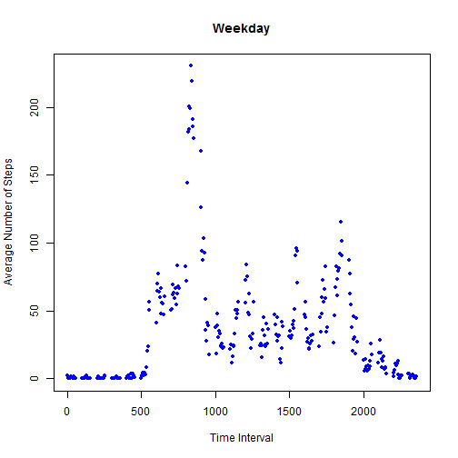
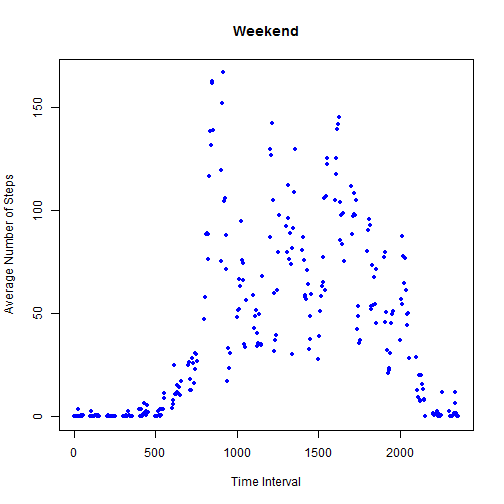

Reproducible Research Assignment 1
==================================
Joel Lahrman  
Date: April 19, 2015

Note: Assignment instructions are printed in **bold** font.

###**Loading and preprocessing the data**

**Show any code that is needed to**  
**1. load the data (i.e. read.csv())**

**2. process/transform the data (if necessary) into a format suitable for your analysis**

Note that the user should set the working directory to be in the same location as this .Rmd file and the Activity.csv

Load the data, and set the stringsAsFactors argument to FALSE to bring in string variables as characters:


```r
activity_data = read.csv("Activity.csv", stringsAsFactors = FALSE)
```


###**What is mean total number of steps taken per day?**

**For this part of the assignment, you can ignore the missing values in the dataset.**  

**1. Calculate the total number of steps taken per day**  

The tapply function can be used to calculate the total number of steps taken per day. The na.rm argument is set to be true so that NA values are ignored by the function.  

The result is converted to a data frame and given an appropriate column title so that it would appear in a nice columnar format if it were to be printed.  

Note that I have elected not to print the data table due to its length, but it could be done simply by adding steps_by_day as the last line of code.


```r
steps_by_day = as.data.frame(tapply(activity_data$steps, activity_data$date, sum, na.rm = TRUE))
colnames(steps_by_day)[1] = "total_steps_per_day"
```

**2. If you do not understand the difference between a histogram and a barplot, research the difference between them. Make a histogram of the total number of steps taken each day.**


```r
hist(steps_by_day$total_steps_per_day, xlab = "Total Number of Steps", ylab = "Frequency", col = "blue", breaks = 20, main = "Steps by Day Histogram")
```

 

**3. Calculate and report the mean and median of the total number of steps taken per day**  


```r
mean(steps_by_day$total_steps_per_day)
```

```
## [1] 9354.23
```

```r
median(steps_by_day$total_steps_per_day)
```

```
## [1] 10395
```

###**What is the average daily activity pattern?**

**1. Make a time series plot (i.e. type = "l") of the 5-minute interval (x-axis) and the average number of steps taken, averaged across all days (y-axis)**  


```r
steps_by_interval = as.data.frame(tapply(activity_data$steps, activity_data$interval, mean, na.rm = TRUE))
steps_by_interval <- cbind(Row.Names = as.numeric(rownames(steps_by_interval)), steps_by_interval)
colnames(steps_by_interval)[1] = "interval"
colnames(steps_by_interval)[2] = "average_steps"

plot(steps_by_interval$interval,steps_by_interval$average_steps, xlab = "Time Interval", ylab = "Average Number of Steps", main="", col = "blue", pch = 20)
```

 

**2. Which 5-minute interval, on average across all the days in the dataset, contains the maximum number of steps?**

For this question I find the maximum value of the average_steps column of the data frame, subset the data frame to match the maximum value, and then extract the value in the first column (which is the time interval). Perhaps not the most elegant solution but it works. The 835 interval contains the maximum average number of steps.


```r
max_steps = max(steps_by_interval$average_steps)
max_steps_by_interval = subset(steps_by_interval, average_steps == max_steps)
max_interval = max_steps_by_interval[1,1]
max_interval
```

```
## [1] 835
```


###**Imputing missing values**

**Note that there are a number of days/intervals where there are missing values (coded as NA). The presence of missing days may introduce bias into some calculations or summaries of the data.**

**1. Calculate and report the total number of missing values in the dataset (i.e. the total number of rows with NAs)**  


```r
missing = which(is.na(activity_data$steps))
length(missing)
```

```
## [1] 2304
```

**2. Devise a strategy for filling in all of the missing values in the dataset. The strategy does not need to be sophisticated. For example, you could use the mean/median for that day, or the mean for that 5-minute interval, etc.**  

Given the variation seen throughout the average number of steps per interval plot that was created, I do not recommend using the mean data for that day (if it exists). It seems much preferable to use the mean for that 5-minute interval to account for the typical daily schedule of an average person (ie, awake and moving during the day, asleep at night)

**3. Create a new dataset that is equal to the original dataset but with the missing data filled in.**

I start with the original activity_data. I then merge it with the steps_by_interval data that has already been created. This dataset is named adjusted_activity_data.


```r
adjusted_activity_data = merge(activity_data,steps_by_interval,by.x="interval",by.y="interval")
head(adjusted_activity_data)
```

```
##   interval steps       date average_steps
## 1        0    NA 2012-10-01      1.716981
## 2        0     0 2012-11-23      1.716981
## 3        0     0 2012-10-28      1.716981
## 4        0     0 2012-11-06      1.716981
## 5        0     0 2012-11-24      1.716981
## 6        0     0 2012-11-15      1.716981
```

I then use an ifelse statement to create a new column. If the value of the steps column is NA, the average_steps value is entered into the new column. If there is a numerical value in the steps column, that value is entered.


```r
adjusted_activity_data$adjusted_steps = ifelse(is.na(adjusted_activity_data$steps),adjusted_activity_data$average_steps,adjusted_activity_data$steps)
head(adjusted_activity_data,20)
```

```
##    interval steps       date average_steps adjusted_steps
## 1         0    NA 2012-10-01      1.716981       1.716981
## 2         0     0 2012-11-23      1.716981       0.000000
## 3         0     0 2012-10-28      1.716981       0.000000
## 4         0     0 2012-11-06      1.716981       0.000000
## 5         0     0 2012-11-24      1.716981       0.000000
## 6         0     0 2012-11-15      1.716981       0.000000
## 7         0     0 2012-10-20      1.716981       0.000000
## 8         0     0 2012-11-16      1.716981       0.000000
## 9         0     0 2012-11-07      1.716981       0.000000
## 10        0     0 2012-11-25      1.716981       0.000000
## 11        0    NA 2012-11-04      1.716981       1.716981
## 12        0     0 2012-11-08      1.716981       0.000000
## 13        0     0 2012-10-12      1.716981       0.000000
## 14        0     0 2012-10-30      1.716981       0.000000
## 15        0     0 2012-11-26      1.716981       0.000000
## 16        0    47 2012-10-04      1.716981      47.000000
## 17        0     0 2012-11-27      1.716981       0.000000
## 18        0     0 2012-10-31      1.716981       0.000000
## 19        0     0 2012-11-18      1.716981       0.000000
## 20        0     0 2012-10-05      1.716981       0.000000
```

**4. Make a histogram of the total number of steps taken each day and Calculate and report the mean and median total number of steps taken per day. Do these values differ from the estimates from the first part of the assignment? What is the impact of imputing missing data on the estimates of the total daily number of steps?**  


```r
adj_steps_by_day = as.data.frame(tapply(adjusted_activity_data$adjusted_steps, adjusted_activity_data$date, sum, na.rm = TRUE))
colnames(adj_steps_by_day)[1] = "total_adj_steps_per_day"

hist(adj_steps_by_day$total_adj_steps_per_day, xlab = "Total Adjusted Number of Steps, with interval mean imputation", ylab = "Frequency", col = "green", breaks = 20, main = "Steps by Day Histogram (with imputed missing data)")
```

 

```r
adj_steps_by_day_mean = mean(adj_steps_by_day$total_adj_steps_per_day)
adj_steps_by_day_median = median(adj_steps_by_day$total_adj_steps_per_day)

adj_steps_by_day_mean
```

```
## [1] 10766.19
```

```r
adj_steps_by_day_median
```

```
## [1] 10766.19
```

The imputation results in the mean and median to become equal, and also raises the mean and median in comparison to the results using the raw data.

###**Are there differences in activity patterns between weekdays and weekends?**

**For this part the weekdays() function may be of some help here. Use the dataset with the filled-in missing values for this part.**

**1. Create a new factor variable in the dataset with two levels - "weekday" and "weekend" indicating whether a given date is a weekday or weekend day.**

First the date field in adjusted_activity_data must be converted to a date:


```r
adjusted_activity_data$date = as.Date(adjusted_activity_data$date)
```

The weekdays function can be applied to create a field that determines the day of the week:


```r
adjusted_activity_data$day_of_week = weekdays(adjusted_activity_data$date)
head(adjusted_activity_data)
```

```
##   interval steps       date average_steps adjusted_steps day_of_week
## 1        0    NA 2012-10-01      1.716981       1.716981      Monday
## 2        0     0 2012-11-23      1.716981       0.000000      Friday
## 3        0     0 2012-10-28      1.716981       0.000000      Sunday
## 4        0     0 2012-11-06      1.716981       0.000000     Tuesday
## 5        0     0 2012-11-24      1.716981       0.000000    Saturday
## 6        0     0 2012-11-15      1.716981       0.000000    Thursday
```

Finally, an ifelse statement is used to assign the day of the week as a weekend or weekday. R probably has something built in for this, but I'll look it up later. I then remove the day of the week; it's not needed


```r
adjusted_activity_data$weekday = as.factor(ifelse(adjusted_activity_data$day_of_week %in% c("Saturday","Sunday"),"Weekend","Weekday"))
adjusted_activity_data$day_of_week = NULL
head(adjusted_activity_data)
```

```
##   interval steps       date average_steps adjusted_steps weekday
## 1        0    NA 2012-10-01      1.716981       1.716981 Weekday
## 2        0     0 2012-11-23      1.716981       0.000000 Weekday
## 3        0     0 2012-10-28      1.716981       0.000000 Weekend
## 4        0     0 2012-11-06      1.716981       0.000000 Weekday
## 5        0     0 2012-11-24      1.716981       0.000000 Weekend
## 6        0     0 2012-11-15      1.716981       0.000000 Weekday
```


**2. Make a panel plot containing a time series plot (i.e. type = "l") of the 5-minute interval (x-axis) and the average number of steps taken, averaged across all weekday days or weekend days (y-axis). See the README file in the GitHub repository to see an example of what this plot should look like using simulated data.**

OK I admit that I am having trouble creating a panel plot. I have tried it in ggplot2 and base plotting but I just can't get it. So I'm going to submit two separate plots instead. I'll have to see if I can find a way to create the panel plot later...


```r
weekday_data = adjusted_activity_data[adjusted_activity_data$weekday == "Weekday",]
weekend_data = adjusted_activity_data[adjusted_activity_data$weekday == "Weekend",]

weekday_steps_by_interval = as.data.frame(tapply(weekday_data$adjusted_steps, weekday_data$interval, mean, na.rm = TRUE))
weekday_steps_by_interval <- cbind(Row.Names = as.numeric(rownames(weekday_steps_by_interval)), weekday_steps_by_interval)
colnames(weekday_steps_by_interval)[1] = "interval"
colnames(weekday_steps_by_interval)[2] = "average_steps"
weekday_steps_by_interval$weekday = "Weekday"

weekend_steps_by_interval = as.data.frame(tapply(weekend_data$adjusted_steps, weekend_data$interval, mean, na.rm = TRUE))
weekend_steps_by_interval <- cbind(Row.Names = as.numeric(rownames(weekend_steps_by_interval)), weekend_steps_by_interval)
colnames(weekend_steps_by_interval)[1] = "interval"
colnames(weekend_steps_by_interval)[2] = "average_steps"
weekend_steps_by_interval$weekday = "Weekend"

plot(weekday_steps_by_interval$interval,weekday_steps_by_interval$average_steps, xlab = "Time Interval", ylab = "Average Number of Steps", main="Weekday", col = "blue", pch = 20)
```

 

```r
plot(weekend_steps_by_interval$interval,weekend_steps_by_interval$average_steps, xlab = "Time Interval", ylab = "Average Number of Steps", main="Weekend", col = "blue", pch = 20)
```

 
